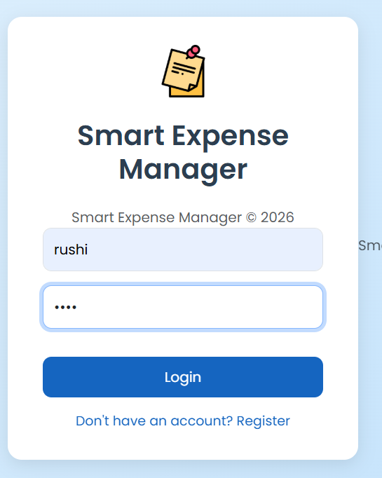
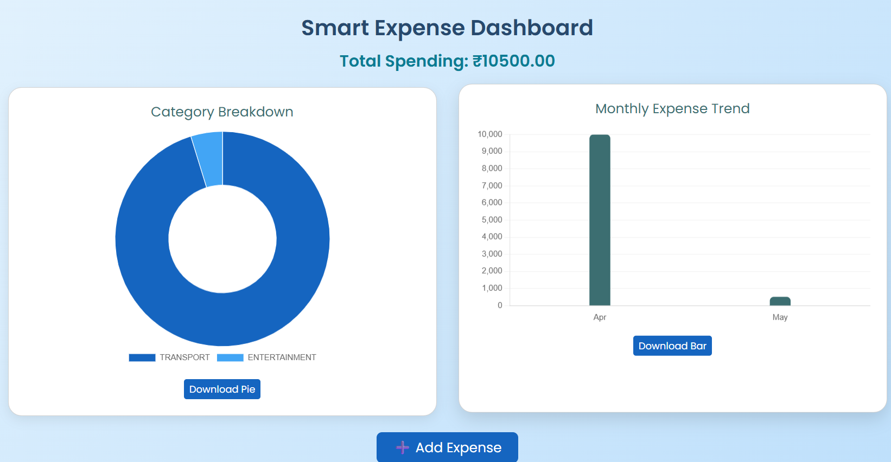
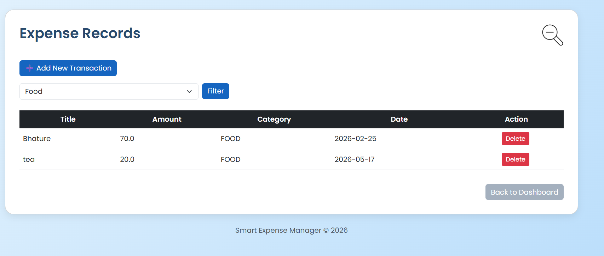
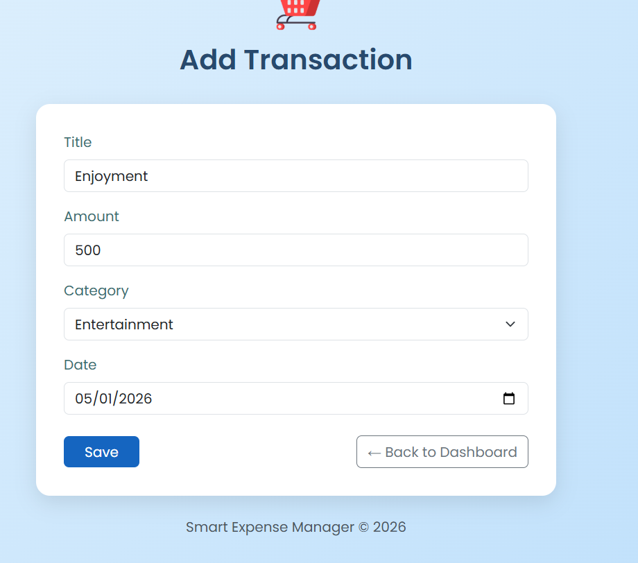

# 💰 Smart Expense Manager

A modern web-based expense tracking application developed using **Spring Boot** and **MySQL** to help users manage and visualize daily expenses efficiently.

---

# 🚀 Features

✅ User Registration & Login Authentication  
✅ Secure Password Encryption using Spring Security  
✅ Add, Update & Delete Transactions  
✅ Category-wise Expense Tracking  
✅ Expense Filtering by Category  
✅ Interactive Dashboard with Charts  
✅ Monthly Expense Analytics  
✅ Responsive UI using Bootstrap

---

# 🛠️ Tech Stack

## Backend
- Java
- Spring Boot
- Spring MVC
- Spring Security
- Spring Data JPA

## Frontend
- HTML5
- CSS3
- Bootstrap
- Thymeleaf
- JavaScript
- Chart.js

## Database
- MySQL

---

# 🏗️ Project Architecture

The project follows **MVC Architecture**:

```text
Controller → Service → Repository → Database
```

---

# 📊 Dashboard Features

📌 Pie Chart for Category-wise Expenses  
📌 Bar Chart for Monthly Expense Trends  
📌 Total Spending Counter  
📌 Download Chart Functionality

---

# 📸 Screenshots

## 🔐 Login Page


---

## 📊 Dashboard


---

## 📋 Expense Records


---

## ➕ Add Transaction


---

# ⚙️ How To Run The Project

## Prerequisites

- Java 17
- MySQL
- Maven
- IntelliJ IDEA / VS Code

---

## Setup Steps

### 1️⃣ Clone Repository

```bash
git clone https://github.com/your-username/smart-expense-manager.git
```

---

### 2️⃣ Open Project

Open the project in IntelliJ IDEA or VS Code.

---

### 3️⃣ Configure Database

Update database credentials inside:

```properties
src/main/resources/application.properties
```

Example:

```properties
spring.datasource.url=jdbc:mysql://localhost:3306/expense_tracker
spring.datasource.username=root
spring.datasource.password=your_password
```

---

### 4️⃣ Run Application

Run:

```text
SmartExpenseManagerApplication.java
```

---

### 5️⃣ Open In Browser

```text
http://localhost:8080
```

---

# 📂 Modules Included

- Authentication Module
- Expense Management Module
- Dashboard & Analytics Module
- Category Filter Module

---

# 🔮 Future Improvements

- Export Expenses to PDF/CSV
- Budget Planning System
- Advanced Filters
- User Profile Management

---

# 👩‍💻 Author

**Harita Patil**